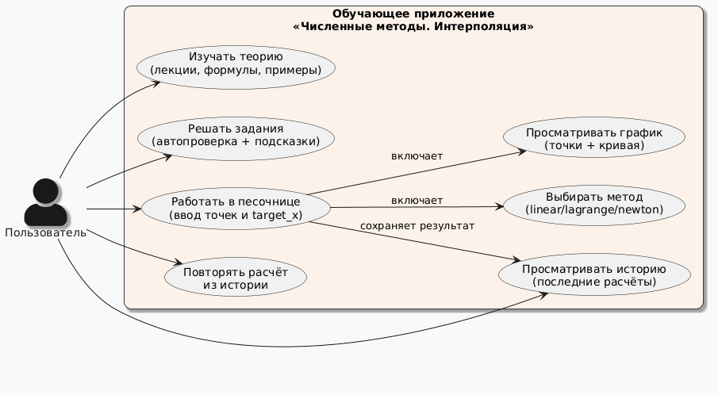
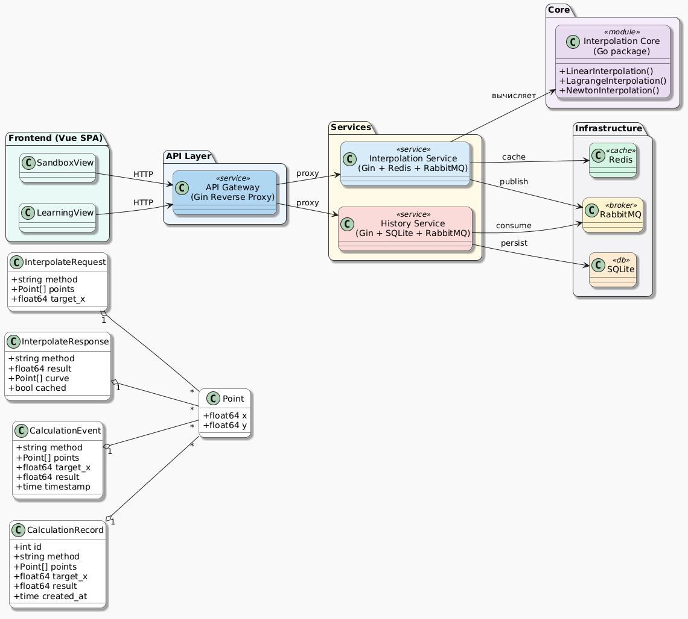
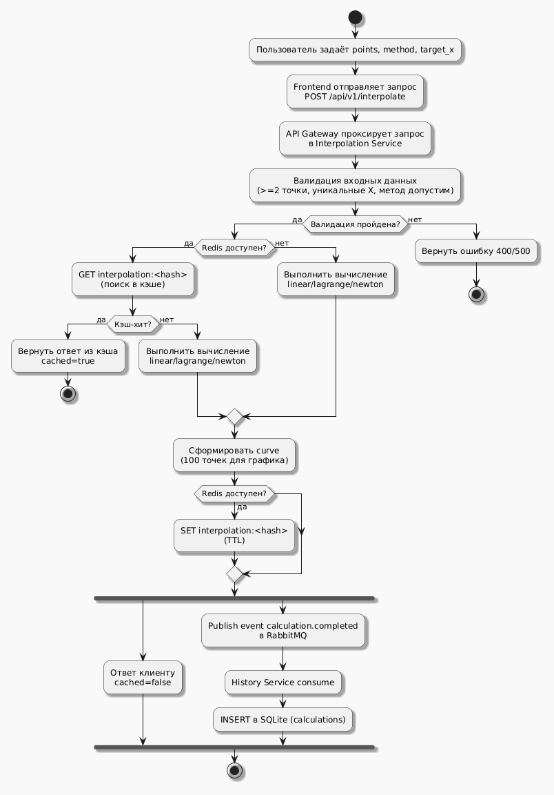
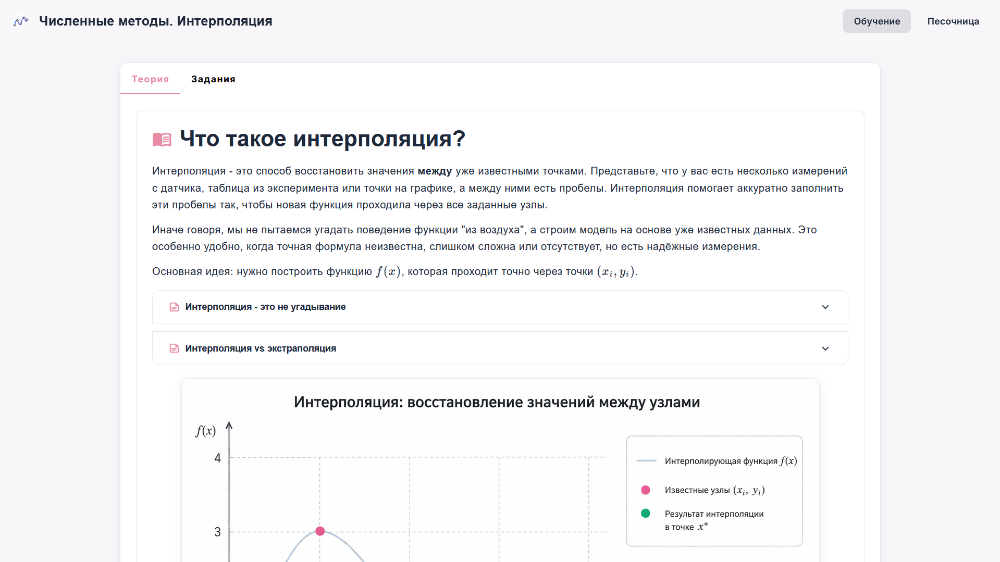
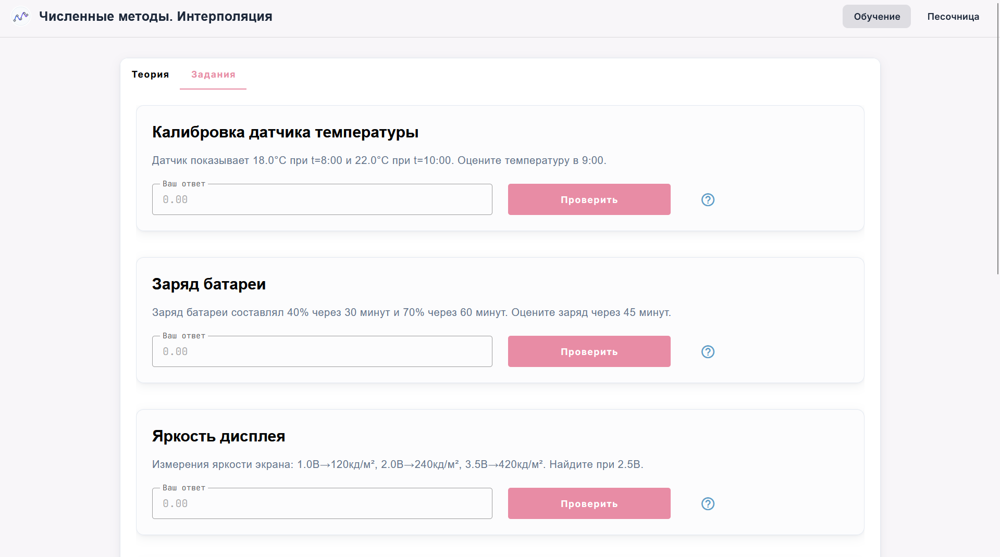
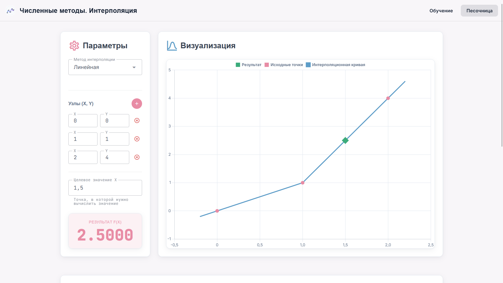
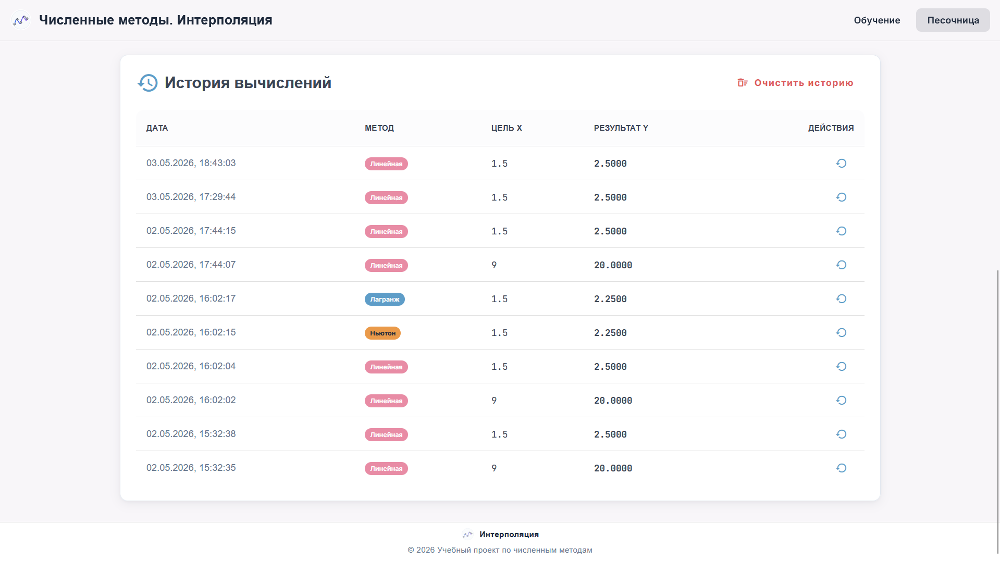
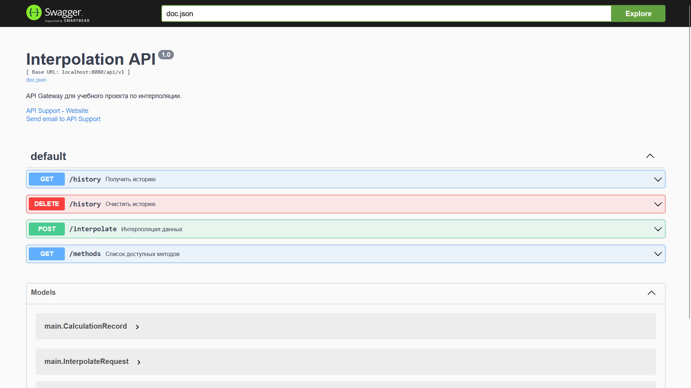
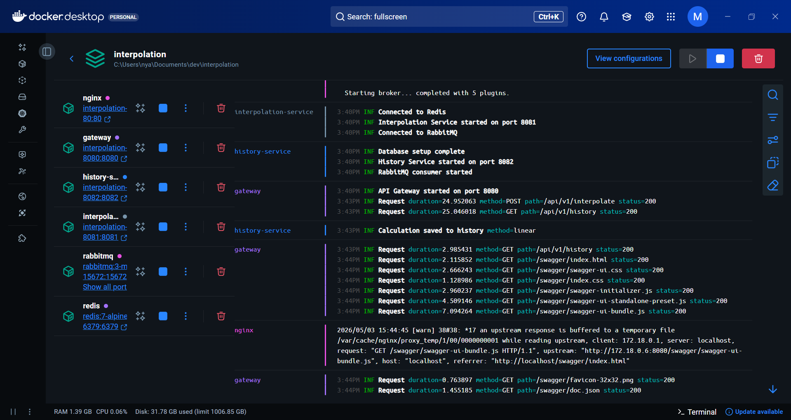

<div align="center">
  
  <h1>Документация проекта <a href="https://github.com/MindlessMuse666/interpolation/blob/main/README.md">interpolation</a></h1>
  <p><b><i>Обучающее приложение "Численные методы. Интерполяция" (∩^o^)⊃━☆</i></b></p>
  <br>
  <div style="display: flex; justify-content: center; gap: 8px; flex-wrap: wrap;">
    
    
    
    
    
    
    
    
    
    
    
    
  </div>
</div>

## 📖 ["Численные методы. Интерполяция"](https://github.com/MindlessMuse666/interpolation) это...

...интерактивное веб-приложение для изучения методов интерполяции (линейная, Лагранж, Ньютон).

Проект является курсовой работой по дисциплине **МДК.02.01 "Технология разработки программного обеспечения"**.

<table style="border-radius: 20px; overflow: hidden; box-shadow: 0 4px 12px rgba(0,0,0,0.1)">
  <tr style="background: #E88CA5;">
    <td colspan="2" style="padding: 16px 24px; text-align: center; font-weight: 700; font-size: 1rem; letter-spacing: 0.5px; color: white;">
      ✨ Рабочее название: interpolation ✨
    </td>
  </tr>
  <tr style="border-bottom: 1px solid #E2E8F0;">
    <td style="padding: 14px 20px; width: 35%; font-weight: 700; background: #F8F6F9; color: #1E293B;">
      🏛️ Тип архитектуры
    </td>
    <td style="padding: 14px 20px; color: #1E293B;">
      Event-Driven Architecture (EDA) + элементы MSA
    </td>
  </tr>
  <tr style="border-bottom: 1px solid #E2E8F0;">
    <td style="padding: 14px 20px; font-weight: 700; background: #F8F6F9; color: #1E293B;">
      📘 Дисциплина
    </td>
    <td style="padding: 14px 20px; color: #1E293B;">
      Технология разработки программного обеспечения
    </td>
  </tr>
  <tr style="border-bottom: 1px solid #E2E8F0;">
    <td style="padding: 14px 20px; font-weight: 700; background: #F8F6F9; color: #1E293B;">
      📌 Курсовой проект
    </td>
    <td style="padding: 14px 20px; color: #1E293B;">
      Проектирование и разработка обучающего приложения по теме: Численные методы. Интерполяция
    </td>
  </tr>
  <tr style="border-bottom: 1px solid #E2E8F0;">
    <td style="padding: 14px 20px; font-weight: 700; background: #F8F6F9; color: #1E293B;">
      👨‍🏫 Преподаватель
    </td>
    <td style="padding: 14px 20px; color: #1E293B;">
      Томашеевич А. А.
    </td>
  </tr>
  <tr>
    <td style="padding: 14px 20px; font-weight: 700; background: #F8F6F9; color: #1E293B;">
      📅 Дата
    </td>
    <td style="padding: 14px 20px; color: #1E293B;">
      2026-05-03
    </td>
  </tr>
</table>

## 🏗 Архитектура

### Общие сведения

Проект построен на микросервисной архитектуре:

- **Nginx**: Раздача SPA и проксирование API/Swagger (Docker);
- **API Gateway**: Маршрутизация, CORS, Rate Limiting (Go + Gin);
- **Interpolation Service**: Вычислительное ядро с кэшированием (Go + Redis);
- **History Service**: Сохранение истории вычислений (Go + SQLite + RabbitMQ);
- **Frontend**: Интерактивный SPA (Vue 3 + Vuetify + Chart.js).

### Диаграмма вариантов использования (Use Case Diagram)

Диаграмма показывает действия пользователя в приложении: изучение теории, выполнение заданий, работа в песочнице и просмотр/очистка истории вычислений.

<div align="center">
  <a href="./docs/diagrams/use-case-diagram.png" target="_blank">
    
  </a>
</div>

### Диаграмма классов (Class Diagram)

Диаграмма отражает ключевые сущности домена (точка, запрос/ответ интерполяции, запись истории) и их связи между сервисами.

<div align="center">
  <a href="./docs/diagrams/class-diagram.png" target="_blank">
    
  </a>
</div>

### Диаграмма активности (Activity Diagram)

Диаграмма описывает основной поток вычисления: валидация входных данных, проверка кэша, вычисление интерполяции, сохранение результата и публикация события истории.

<div align="center">
  <a href="./docs/diagrams/activity-diagram.png" target="_blank">
    
  </a>
</div>

## 📂 Структура проекта

Проект разделён на **frontend** (SPA) и **backend** (набор Go-сервисов), а инфраструктурные зависимости описаны через Docker Compose.

```text
interpolation/
├─ backend/
│  ├─ core/
│  │  └─ interpolation/        # вычислительное ядро (алгоритмы интерполяции)
│  ├─ gateway/                 # API Gateway (маршрутизация, CORS, rate limiting, Swagger)
│  ├─ interpolation/           # Interpolation Service (HTTP API, кэш Redis)
│  ├─ history/                 # History Service (SQLite + RabbitMQ)
│  ├─ go.mod / go.sum          # зависимости Go-модуля
│  └─ */Dockerfile             # сборка контейнеров backend-сервисов
├─ frontend/                   # Vue 3 + Vite + Vuetify (SPA)
│  ├─ src/
│  │  ├─ views/                # страницы (обучение/песочница)
│  │  ├─ components/           # переиспользуемые компоненты (графики и т. п.)
│  │  ├─ router/               # маршрутизация
│  │  └─ assets/               # изображения для теоретических материалов
│  └─ Dockerfile               # сборка фронтенда
├─ docker/                     # конфигурация инфраструктуры (nginx/redis/rabbitmq)
├─ config/                     # конфигурация приложения (config.toml)
├─ docs/                       # спецификации, диаграммы, скриншоты
│  ├─ diagrams/                # UML-диаграммы проекта
│  └─ .screenshots/            # скриншоты UI
├─ docker-compose.yml          # оркестрация сервисов и инфраструктуры
└─ README.md                   # документация проекта
```

## 🖼️ Скриншоты

<div align="center">
  <a href="./docs/.screenshots/learning_page_theory.png" target="_blank">
    
  </a>
  <div><sub><b>Обучение</b> - теоретический материал</sub></div>
  <br />

  <a href="./docs/.screenshots/learning_page_practical.png" target="_blank">
    
  </a>
  <div><sub><b>Обучение</b> - практические задания</sub></div>
  <br />

  <a href="./docs/.screenshots/sandbox_main.png" target="_blank">
    
  </a>
  <div><sub><b>Песочница</b> - ввод точек и визуализация графика</sub></div>
  <br />

  <a href="./docs/.screenshots/sandbox_calculations_history.png" target="_blank">
    
  </a>
  <div><sub><b>Песочница</b> - история вычислений</sub></div>
  <br />

  <a href="./docs/.screenshots/swagger_ui.png" target="_blank">
    
  </a>
  <div><sub><b>Swagger UI</b> - интерактивная документация API</sub></div>
  <br />

  <a href="./docs/.screenshots/docker_desktop.png" target="_blank">
    
  </a>
  <div><sub><b>Docker Desktop</b> - запущенные контейнеры проекта</sub></div>
</div>

## 🚀 Запуск через Docker Compose

```bash
docker compose up --build
```

## 📚 API-Документация

- Фронтенд: `http://localhost/`
- API Gateway: `http://localhost/api/v1/`
- Swagger: `http://localhost/swagger/index.html`
- RabbitMQ Management: `http://localhost:15672` (guest/guest)

## ⚙️ Технологии

- **Backend**: Go 1.25.5, Gin, Redis, RabbitMQ, SQLite.
- **Frontend**: Vue 3, Vuetify 3, Chart.js.
- **DevOps**: Docker, Docker Compose, Nginx.

---

<div align="center">
  
  <br>
    <sub><b>Веб-приложение // Численные методы. Интерполяция</b></sub>
    <br>
    <sup><i>Made with love by <a href="https://github.com/MindlessMuse666" target="_blank" title="MindlessMuse666">MindlessMuse666</a></i></sup>
</div>
