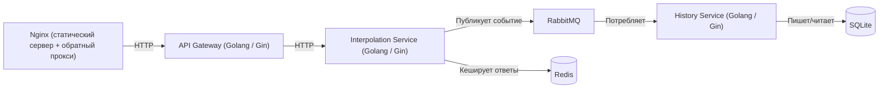
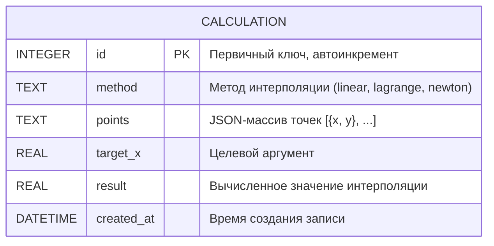

<div align="center">
  
  <br/>
  <br/>
  <div style="display: flex; justify-content: center; gap: 8px; flex-wrap: wrap;">
    
    
    
    
    
    
    
    
    
  </div>
</div>

# Software Requirements Specification  

## Обучающее приложение "Численные методы. Интерполяция"  

### Рабочее название: interpolation  

**Тип архитектуры:** Event-Driven Architecture (EDA) + элементы MSA  
**Дисциплина:** Технология разработки программного обеспечения  
**Курсовая работа:** Проектирование и разработка обучающего приложения по теме: Численные методы. Интерполяция  
**Преподаватель:** Томашеевич Александр Андреевич  
**Дата:** 2026-04-28  

---

## 1. Введение  

### 1.1 Назначение документа  

Данный документ содержит полный набор программных требований к обучающему веб-приложению, посвящённому численным методам интерполяции. Он служит основой для проектирования, реализации и приёмки системы.  

**Целевая аудитория:** студенты, впервые знакомящиеся с интерполяцией, и все интересующиеся численными методами, желающие поэкспериментировать в интерактивной среде ("песочнице").

### 1.2 Границы проекта  

- Приложение предоставляет интерактивное обучение трём методам интерполяции: линейная, Лагранж, Ньютон.  
- Реализуется как одностраничное веб-приложение (SPA) с двумя логическими страницами: обучение и песочница.  
- Вычислительное ядро отделено от пользовательского интерфейса, взаимодействие через REST API.  
- История вычислений сохраняется и отображается.

### 1.3 Определения и сокращения  

| Термин | Описание |
|--------|----------|
| SPA | Single Page Application - одностраничное приложение |
| EDA | Event-Driven Architecture - событийно-управляемая архитектура |
| MSA | Microservices Architecture - микросервисная архитектура |
| API Gateway | Шлюз, маршрутизирующий клиентские запросы к микросервисам |
| Интерполяция | Метод нахождения промежуточных значений функции по дискретному набору точек |

---

## 2. Общее описание системы  

### 2.1 Перспектива продукта  

Система разрабатывается как демонстрационный учебный проект, акцентирующий современные подходы к построению распределённых систем. Она объединяет классическое обучение численным методам с практикой инженерной архитектуры. После запуска система функционирует автономно в Docker-окружении.

### 2.2 Основные функциональные возможности  

- Просмотр теоретических материалов с визуальными примерами.  
- Выполнение заданий с подсказками и автоматической проверкой.  
- Свободное экспериментирование с точками, методами и целевыми координатами.  
- Построение графиков интерполяционных кривых и исходных точек.  
- Сохранение и просмотр истории вычислений.  
- Кеширование повторяющихся вычислений.

### 2.3 Классы пользователей  

**Пользователь (user)** - неавторизованный посетитель, взаимодействующий с приложением. Может изучать теорию, выполнять упражнения, работать в песочнице, просматривать историю. Ролевая модель отсутствует.

### 2.4 Предположения и зависимости  

- Все компоненты разворачиваются в Docker-контейнерах, оркестрируемых Docker Compose.  
- Сетевое взаимодействие осуществляется внутри виртуальной сети Docker.  
- Клиенту достаточно современного браузера с поддержкой ES6 и Canvas.

---

## 3. Архитектура системы и обоснование стека  

**Ключевое решение:** система проектируется как **Event-Driven Architecture (EDA)** с разделением на слабосвязанные сервисы, асинхронно общающиеся через брокер сообщений. Это позволяет гибко добавлять новые функции (например, уведомления, аналитику) без модификации вычислительного ядра.

### 3.1 Диаграмма компонентов  



### 3.2 Обоснование технологического стека  

| Компонент | Технология | Обоснование |
|-----------|------------|-------------|
| Backend-ядро (Interpolation Service) | **Golang + Gin** | Высокая производительность HTTP, конкурентность, лёгкое развёртывание, статическая типизация. Gin даёт удобную маршрутизацию и middleware. |
| API Gateway | **Golang + Gin** | Единая точка входа с минимальным оверхедом. Настройка CORS, rate limiting, валидация. |
| Брокер сообщений | **RabbitMQ** | Гарантированная доставка, гибкая маршрутизация (exchanges/routing keys), развязка вычислительного сервиса и сервиса истории. |
| Кэш | **Redis** | In-memory хранение результатов интерполяции по хешу параметров. Сокращает задержку повторных запросов на 90%+, уменьшает вычислительную нагрузку. TTL предотвращает неограниченный рост кэша. |
| База данных | **SQLite** | Лёгкая, не требует отдельного сервера, идеально подходит для учебного проекта. History Service хранит записи в файле в Docker-томе. |
| Фронтенд | **Vue 3 + Vite + Vuetify** | Современный реактивный фреймворк, быстрая сборка, богатая UI-библиотека компонентов. |
| Графики | **Chart.js** (vue-chartjs) | Простая интеграция, отрисовка точечных и линейных графиков. |
| HTTP-клиент | **Axios** | Удобный API, перехватчики ошибок. |
| Контейнеризация | **Docker + Docker Compose** | Воспроизводимость окружения, изоляция сервисов, запуск одной командой. |
| Обратный прокси | **Nginx** | Обслуживание статических файлов SPA, проксирование API-запросов к Gateway. |

#### Осознанный выбор формата конфигураций  

Для повышения читаемости и удобства сопровождения все конфигурационные файлы сервисов (порты, адреса Redis/RabbitMQ, TTL и др.) записываются в формате **TOML**. TOML поддерживает комментарии, минимизирует синтаксический шум по сравнению с JSON и интуитивно понятен человеку. В коде Go используется библиотека `github.com/BurntSushi/toml`. Учебные задания (tasks) также хранятся в виде `tasks.toml`, что позволяет легко пополнять банк упражнений без правок исходного кода.

### 3.3 Почему Event-Driven?  

- **Развязка сервисов:** Interpolation Service не зависит от схемы БД истории. При добавлении новых потребителей (аналитика, уведомления) не нужно изменять вычислительный модуль.  
- **Отказоустойчивость:** если History Service временно недоступен, сообщения сохраняются в очереди RabbitMQ и обрабатываются после восстановления.  
- **Асинхронное масштабирование:** пиковые нагрузки на запись истории не влияют на время ответа основного API.

---

## 4. Требования к интерфейсам  

### 4.1 REST API (Gateway → внешний мир)  

Все эндпоинты доступны по префиксу `/api/v1/`. Gateway принимает запросы от фронтенда, маршрутизирует их к внутренним сервисам.

#### 4.1.1 Получить список методов интерполяции  

`GET /api/v1/methods`  

**Ответ:** `200 OK`  

```json
{
  "methods": ["linear", "lagrange", "newton"]
}
```

#### 4.1.2 Выполнить интерполяцию  

`POST /api/v1/interpolate`  

**Тело запроса:**  

```json
{
  "method": "lagrange",
  "points": [
    {"x": 0, "y": 1},
    {"x": 1, "y": 3},
    {"x": 2, "y": 2}
  ],
  "target_x": 1.5
}
```

**Валидация:**  

- `points` - массив уникальных точек (x не повторяются), минимум 2 элемента.  
- `target_x` - число.  
- `method` - одно из допустимых значений.

**Ответ:** `200 OK`  

```json
{
  "result": 2.75,
  "curve_points": [
    {"x": 0.0, "y": 1.0},
    {"x": 0.1, "y": 1.2},
    ...
  ]
}
```

`curve_points` - массив точек, образующих плавную кривую для графика (не менее 100 точек). При ошибках возвращается `4xx` с описанием.

#### 4.1.3 Получить историю вычислений  

`GET /api/v1/history`  

**Ответ:** `200 OK`  

```json
[
  {
    "id": 1,
    "method": "lagrange",
    "points": [{"x":0,"y":1},{"x":1,"y":3},{"x":2,"y":2}],
    "target_x": 1.5,
    "result": 2.75,
    "created_at": "2026-04-28T10:20:30Z"
  }
]
```

### 4.2 Внутренние асинхронные события  

Interpolation Service после успешного вычисления отправляет сообщение в RabbitMQ.

| Параметр | Значение |
|----------|----------|
| Exchange | `calculations` |
| Routing Key | `calculation.completed` |
| Формат сообщения | JSON |

**Структура сообщения:**  

```json
{
  "method": "lagrange",
  "points": [{"x":0,"y":1}, ...],
  "target_x": 1.5,
  "result": 2.75,
  "timestamp": "2026-04-28T10:20:30Z"
}
```

History Service потребляет сообщения из очереди `history_queue` и сохраняет запись в SQLite.

### 4.3 Кеширование (Redis)  

Ключ кэша строится как:  

```
interpolation:<md5(method + отсортированные_точки + target_x)>
```

Значение - JSON с полями `result` и `curve_points`. TTL - 3600 секунд (1 час). При попадании в кэш вычисление не производится, событие в RabbitMQ не отправляется.

---

## 5. Функциональные требования  

### 5.1 Модуль интерполяции (Interpolation Service)  

Расположен в пакете `core/interpolation` на Go. Три публичные функции:

- `LinearInterpolation(points []Point, x float64) (float64, []Point, error)`  
- `LagrangeInterpolation(points []Point, x float64) (float64, []Point, error)`  
- `NewtonInterpolation(points []Point, x float64) (float64, []Point, error)`

Каждая возвращает вычисленное значение `y` для заданного `x` и массив точек кривой для построения графика.

### 5.2 Валидация входных данных  

- Все x-координаты точек уникальны.  
- Количество точек ≥ 2.  
- Метод - одно из допустимых значений.

### 5.3 Страница "Обучение"  

- **Теория:** объяснение пяти тем (что такое интерполяция, применение, линейная, Лагранж, Ньютон) с текстами, изображениями/анимациями.  
- **Практика с подсказками:** 5-7 предустановленных заданий с автопроверкой введённого ответа.  
- **Свободная практика:** ввод своих точек, выбор метода, отправка запроса, отображение результата и графика.

### 5.4 Страница "Песочница"  

- Динамическое добавление / удаление точек (минимум 2).  
- Выбор метода интерполяции.  
- Изменение значения `target_x` (поле ввода / слайдер).  
- Мгновенная перерисовка графика при изменении параметров (debounce 300 мс).  
- График отображает исходные точки (scatter) и интерполяционную кривую (line).

### 5.5 Отображение истории  

На любой странице доступна панель последних 10 вычислений с возможностью повторить запрос в песочнице.

---

## 6. Нефункциональные требования  

| Категория | Требование | Механизм реализации |
|-----------|------------|---------------------|
| **Производительность** | 95-й перцентиль времени ответа на запрос интерполяции (без кэша) < 200 мс; кэшированный запрос < 10 мс. | Go-горутины, Redis in-memory кэш, Gin, хеширование запросов. |
| **Пропускная способность** | API Gateway выдерживает ≥ 200 запросов/с. | Stateless-архитектура, Nginx upstream при необходимости. |
| **Безопасность** | Защита от инъекций, валидация всех входных данных, CORS (разрешён только origin фронтенда), ограничение частоты запросов. | Строгая типизация Go, middleware CORS и rate limiter (Redis sliding window), валидация структур с тегами `validate`. |
| **Доступность** | Сервис интерполяции работает при отказе History Service или RabbitMQ (деградация: история не сохраняется). При отказе Redis вычисления продолжаются без кэша. | Graceful degradation: проверка доступности зависимостей, логирование ошибок. |
| **Надёжность** | Гарантированная доставка событий истории, отсутствие потерь при сбоях. | Durable очереди и persistent delivery mode в RabbitMQ; подтверждение (ack) после записи в БД. |
| **Масштабируемость** | Горизонтальное масштабирование вычислительного и исторического сервисов. | Stateless-сервисы, общие Redis и RabbitMQ; Docker Compose scale. |
| **Удобство сопровождения** | Код соответствует `gofmt`, покрыт юнит-тестами (>80% для вычислительного модуля, интеграционные тесты API). Автоматическая документация Swagger. Конфигурации вынесены в TOML-файлы. | Go пакеты с тестами, CI-проверки, swaggo/swag, zerolog, BurntSushi/toml. |
| **Совместимость** | Корректная работа в актуальных версиях Chrome, Firefox, Safari. Адаптивный интерфейс для мобильных устройств. | Vuetify с адаптивными классами, тестирование в браузерах. |
| **Отказоустойчивость очереди** | RabbitMQ не теряет сообщения при длительном простое History Service. | Настройка watermarks и disk free limit, политика lazy queues. |
| **Управление конфигурацией** | Все конфигурации внешних зависимостей и бизнес-логики (методы, задания) хранятся в виде TOML-файлов, а не в коде или JSON с избыточной пунктуацией. | `config.toml`, `tasks.toml`; парсинг через BurntSushi/toml. |

---

## 7. Модели данных  

### 7.1 База данных SQLite (History Service)  

**ER-диаграмма (сущность "calculation"):**  



**Табличное описание сущности:**  

| Атрибут | Тип данных | Описание | Nullable | Ограничения |
|---------|------------|----------|----------|-------------|
| `id` | INTEGER | Уникальный идентификатор | NOT NULL | PRIMARY KEY, AUTOINCREMENT |
| `method` | TEXT | Код метода (linear, lagrange, newton) | NOT NULL | CHECK(method IN ('linear','lagrange','newton'))? (прикладной уровень) |
| `points` | TEXT | JSON-строка, содержащая массив исходных точек {x, y} | NOT NULL | Валидный JSON |
| `target_x` | REAL | Значение аргумента, для которого производилась интерполяция | NOT NULL | |
| `result` | REAL | Полученное значение функции | NOT NULL | |
| `created_at` | DATETIME | Временная метка создания записи | NOT NULL | DEFAULT CURRENT_TIMESTAMP |

---

## 8. Требования к фронтенду  

- Проект создан с использованием Vite + Vue 3 (шаблон `create vue@latest` или аналогичный).  
- Две страницы через Vue Router: `/learning`, `/sandbox`.  
- UI-компоненты Vuetify 3 (Material Design).  
- Графики на базе `vue-chartjs` (scatter + line).  
- Структура каталогов:  

```
src/
  main.js
  App.vue
  router/index.js
  services/api.js
  views/LearningView.vue
  views/SandboxView.vue
  components/TheoryBlock.vue
  components/PracticeBlock.vue
  components/FreePracticeBlock.vue
  components/PointsInput.vue
  components/MethodSelect.vue
  components/ChartView.vue
  components/ResultCard.vue
```

---

## 9. Docker и развёртывание  

Файл `docker-compose.yml` определяет сервисы:  

- **nginx** - раздача статики фронтенда, проксирование API.  
- **api-gateway** - скомпилированный образ из `backend/gateway/`, порт 8080 (внутренний).  
- **interpolation-service** - порт 8081.  
- **history-service** - порт 8082.  
- **redis** - официальный образ, без внешнего порта.  
- **rabbitmq** - официальный образ с management-плагином (порт 15672 доступен только для разработки).  

Запуск:  

```bash
docker compose up --build
```

---

## 10. Документация API  

Gateway автоматически генерирует Swagger/OpenAPI-спецификацию по адресу `/swagger/index.html` (пакет `swaggo/swag` для Go и аннотации в коде).

---

## 11. Управление версиями  

Разработка ведётся с применением Git. Репозиторий размещён на GitHub. Ветка для основной разработки - `main`. Все коммиты должны соответствовать стилю, описанному в разделе "Руководство для нейро-программиста".

---

## 12. Руководство для нейро-программиста  

### 12.1 Принципы разработки  

- **Последовательная разработка:** реализация ведётся поэтапно, в соответствии с архитектурными слоями (ядро, API, фронтенд, интеграция). Каждый этап завершается рабочим прототипом.  
- **Best practice подходы:** следование общепринятым идиомам Go (чистая архитектура, DRY), компонентному подходу Vue (Single File Components), контейнеризации с разделением обязанностей.  
- **Ориентация на требования:** все решения должны строго соответствовать данному SRS и промпту задания. Любое отклонение требует обоснования.

### 12.2 Формат коммитов  

Все коммиты должны следовать стилю [Conventional Commits](https://www.conventionalcommits.org/ru/v1.0.0/).  

**Структура:**  

```
<type>(<scope>): <краткое описание>
```

**Типы (`type`):**  

- `feat` - новая функциональность  
- `fix` - исправление ошибки  
- `refactor` - переработка кода без изменения логики  
- `docs` - изменения документации  
- `style` - оформление, пробелы, форматирование (не влияет на работу)  
- `test` - добавление или обновление тестов  
- `chore` - рутинные задачи (обновление зависимостей, конфигурация сборки)  

**Области (`scope`):**  

- `be` - backend (общее)  
- `interpolation` - ядро интерполяции  
- `api` - API Gateway или эндпоинты  
- `history` - сервис истории  
- `fe` - frontend  
- `ui` - интерфейсные компоненты  
- `config` - конфигурационные файлы (TOML, Docker)  
- `docs` - документация  

**Примеры корректных сообщений:**  

- `feat(interpolation): реализован многочлен Лагранжа`  
- `feat(api): добавлен эндпоинт GET /api/v1/history`  
- `feat(fe): свёрстан компонент песочницы`  
- `fix(fe): исправлена ширина графиков на мобильных`  
- `refactor(interpolation): выделены общие вспомогательные функции`  
- `test(api): интеграционные тесты интерполяции`  
- `chore(config): переведены конфигурации на TOML`  

После каждого логически завершённого запроса нейро-программист **обязан** предлагать сообщение коммита в указанном формате, резюмируя выполненные изменения.

---

<div align="center">
  
</div>
